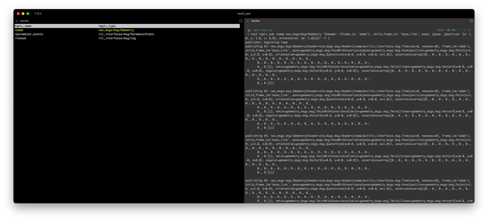
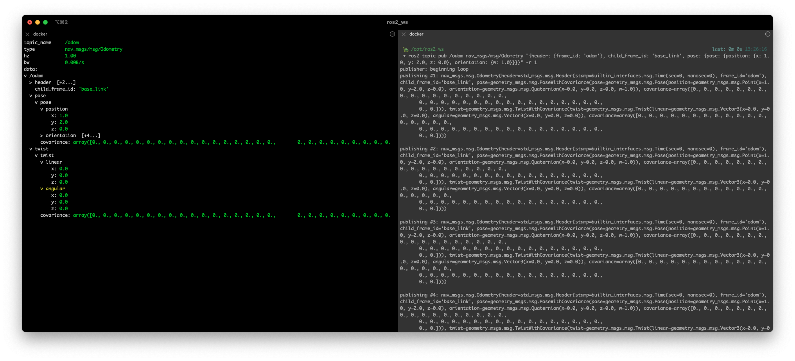

# ROS2 Monitor

[English](#english) | [中文](#chinese)

<a name="english"></a>
## ROS2 Monitor - A Terminal-based Topic Monitor for ROS2

ROS2 Monitor is a Terminal User Interface (TUI) tool for monitoring ROS2 topics, inspired by Apollo's Cyber Monitor and implemented with reference to rqt_topic. It provides a lightweight and efficient way to monitor ROS2 topics directly in your terminal.

### Features

- Terminal-based user interface for monitoring ROS2 topics
- Real-time topic data visualization
- Easy to use keyboard navigation
- Support for all ROS2 message types

### Screenshots

#### Topic List View


#### Message Detail View


### Installation

```bash
# Clone the repository
git clone https://github.com/Manchey/ros2monitor.git

# Navigate to the workspace
cd ros2monitor

# Build the package
colcon build

# Source the workspace
source install/setup.bash
```

### Usage

```bash
# Run the monitor
ros2 run ros2monitor ros2monitor
```

### License

This project is licensed under the Apache License 2.0 - see the LICENSE file for details.

---

<a name="chinese"></a>
## ROS2 Monitor - ROS2终端话题监控工具

ROS2 Monitor 是一个终端用户界面（TUI）工具，用于监控ROS2话题。该工具的灵感来自Apollo的Cyber Monitor，参考了rqt_topic的实现方式。它提供了一种轻量级且高效的方式，直接在终端中监控ROS2话题。

### 特性

- 基于终端的用户界面，用于监控ROS2话题
- 实时话题数据可视化
- 简单的键盘导航
- 支持所有ROS2消息类型

### 界面展示

#### 话题列表视图


#### 消息详情视图


### 安装方法

```bash
# 克隆仓库
git clone https://github.com/Manchey/ros2monitor.git

# 进入工作空间
cd ros2monitor

# 构建包
colcon build

# 加载环境
source install/setup.bash
```

### 使用方法

```bash
# 运行监控工具
ros2 run ros2monitor ros2monitor
```

### 许可证

本项目采用Apache License 2.0许可证 - 详情请参见LICENSE文件。 
